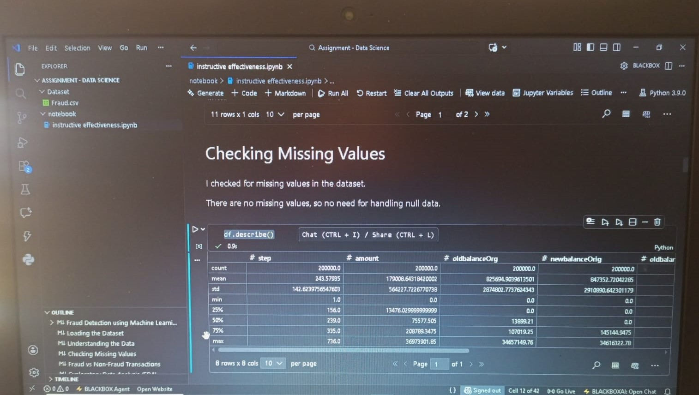
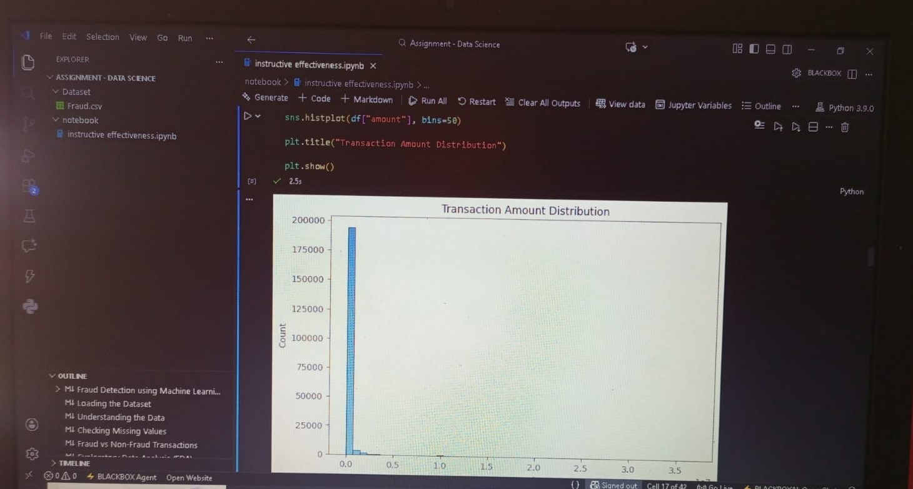

# Fraud Detection System using Machine Learning

## Project Overview

This project is a Machine Learning-based system that detects fraudulent transactions.
It analyzes transaction data and predicts whether a transaction is Fraud or Not Fraud.

---

## Problem Statement

Fraudulent activities in financial transactions cause huge losses.
The goal of this project is to build a model that can automatically identify fraud cases using data analysis and machine learning techniques.

---

## Dataset

This project uses a financial transactions dataset for fraud detection.

* Total Records: 284,807
* Total Features: 31
* Target Column: `Class`

  * 0 → Legitimate Transaction
  * 1 → Fraudulent Transaction

### Data Challenge

The dataset is highly imbalanced:

* Majority of transactions are normal
* Very few transactions are fraud

To handle this, techniques like oversampling or balancing methods are used during model training.

### Features Include

* Transaction Time
* Transaction Amount
* Other anonymized features (V1 to V28)

---

## Technologies Used

* Python
* Pandas
* NumPy
* Scikit-learn
* Matplotlib

---

## How to Run the Project

1. Clone the repository:

```bash
git clone <your-repo-link>
cd fraud-detection-project
```

2. Install required libraries:

```bash
pip install -r requirements.txt
```

3. Run the Jupyter Notebook:

```bash
jupyter notebook
```

4. Open the notebook file and run all cells.

---

## Project Workflow

* Data Collection
* Data Preprocessing
* Handling Imbalanced Data
* Model Training
* Model Evaluation
* Prediction

---

## Output

The model predicts whether a transaction is:

* Legitimate
* Fraudulent

Evaluation metrics such as accuracy, precision, and recall are used to measure performance.

---

## Screenshots

### Sample Outputs





---

## Project Structure

```bash
fraud-detection-project/
│
├── fraud_detection_model.ipynb
├── requirements.txt
├── README.md
├── fraud-detection image 1.jpeg
├── fraud-detection image 2.jpeg
├── fraud-detection image 3.jpeg
```

---

## Future Improvements

* Deploy as a web application
* Use advanced models like XGBoost
* Improve accuracy with more data

---

## Author

Abinaya

---

## If you like this project

Consider giving it a star on GitHub.
